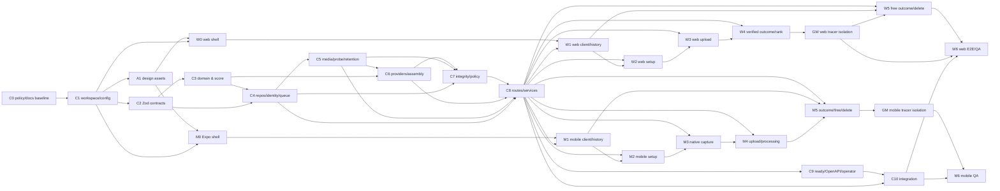

# RevelAI delivery DAG and review ledger

This is the dependency authority for the Core, Web, and Mobile plans. A node starts only after all incoming nodes are accepted. Nodes may run in parallel only when they change disjoint files and use an already accepted contract.

## Contract gates

| Gate | Producer | Consumers blocked until accepted | Required proof |
| --- | --- | --- | --- |
| G0: Policy baseline | C0 | all nodes | docs-only candidate includes `AGENTS.md`, `docs/agents`, and final in-repo fix report; `git diff --check`; every Sol finding maps to a rule/task. |
| GA: Visual assets | A1 | W0, M0 | one-time importer verifies external provenance/source hashes before copy; then a clean **post-A1** checkout with source directory absent passes portable `rtk pnpm verify:design-assets` against repository destinations/hero/crops/receipt only. Temporary missing/false receipt or destination hash/dimension mutation fails. |
| G1: Runtime/config | C1 | C2, A1, W0, M0 | pinned config tests, root standalone design-asset verifier command, and secret/HTTPS/public-mode rejection tests. |
| G2: Transport | C2 | C3, C4 | header identity, CalibrationSession, free/verified create, four outcomes, provenance/result variants, live leaderboard/list/error fixtures. |
| G3: Pure behavior | C3 | C4, C6 | transition, continuous-pass, score/rank snapshot fixtures only; no API/provider dependency. |
| G4: Media evidence | C5 | C6, C7, C8 | stream/sniff/probe/extraction-manifest/Free-media/retention-scavenger safety tests; no visual calibration decision. |
| G5: Analysis policy | C7 | C8 | named Workflow observations, deterministic reference/active-stability geometry, safe evaluator codes, `WorkflowBenchmarkReceiptSchema`, and missing/stale/failed/passing parsed-fixture policy matrix. A live passed receipt gates only real policy activation, never C8/demo. |
| G6: Public vertical slice | C8 | C9, C10, W1–W5, M1–M5 | C8-owned Fastify public vertical slice only: exact transport and media-wire/error contracts, CalibrationSession/attempt routes, Free pipeline, verified demo result structurally non-ranking without a live receipt, parsed `WorkflowBenchmarkReceipt` ranked mock, and transactional deletion guard. |
| G7: Operator proof | C9 | C10 | OpenAPI parity, readiness negative tests, redaction, Workflow/retention operator docs. |
| G8: Integrated truth | C10 | W6, M6 | real demo HTTP Free+verified flows and mocked approved-policy competitive/race positive flow. |
| GW: Web production-tracer isolation | W4 | W5, W6 | W2/W3's shared `reviewRoutesEnabled` omits both `/_test/verified/*` paths from the production router; served `vite build --mode production` navigation cannot mount/evaluate review components or fake ports; W4 registers exactly one public `/verified` tracer. This gate is produced after W4 and is never required by W4 or any Core node. |
| GM: Mobile production-tracer isolation | M5 | M6 | M2/M3/M4's named `review-harness/**` scenarios remain outside Expo Router; native and Expo-web production former-review deep links reach `+not-found` without fake-port evaluation; M5 registers exactly one public `/verified` `ProductionVerifiedTracer`. This gate is produced after M5 and is never required by M5 or any Core node. |

## Client ownership rules

- W0/M0 own only runtime/home visual shell and explicitly unavailable targets. Before W1/W4/W5/M1/M5, their History, verified mode, ranking, and Free controls either route to a screen that says `Disponível após ativação do fluxo` with no server call, or remain disabled with that accessible explanation. Production `Desafio verificado` stays unavailable through W2/W3 and M2/M4; `Treino livre` stays unavailable through W2–W4 and M2–M4. They do not create placeholder feature logic.
- W1/M1 own parsed API client, identity, shared upload/error fixtures, and history only after C8. W2/W3 use `reviewRoutesEnabled = import.meta.env.DEV || import.meta.env.MODE === "test"`: their `/_test/verified/setup` and `/_test/verified/capture` routes are registered only when true, and a production router omits both before matching. M2/M3/M4 are not Expo Router routes at all: named `review:verified-setup`, `review:verified-capture`, and `review:verified-upload-pending` component-harness scenarios live in `apps/mobile/src/review-harness/**`, outside `apps/mobile/app/**`, with injected fake ports and no URI/deep-link. Native and Expo-web production deep-link tests prove each former review path reaches `+not-found`, evaluates no fake port, and makes zero server mutation. W4 registers exactly one public Web `/verified` tracer and owns calibration-session POST, ready POST, verified Attempt POST, media attach POST, preview/upload/pending/terminal/ranking; after W4, GW accepts its route-isolation proof and then unblocks W5/W6. W5 owns the full web Free tracer. M5 registers exactly one public Mobile `/verified` tracer and is the sole mobile production tracer for both verified and Free, including the same verified POST/attach chain and all terminal routes; after M5, GM accepts its isolation proof and then unblocks M6. GW and GM are not prerequisites of their producers or of any Core node. Every real creation/attach occurs only after its next owner state is mounted. This prevents fake review UI leakage, orphan attempts, and overlapping renderers.
- A feature node may activate a previously unavailable home control only in its own review slice. QA nodes do not implement functionality.

## Review-sized delivery order

1. C0 is documentation-only and stages only repository-resident paths; C1 supplies the executable root verifier; then A1 imports evidence, commits its receipt, and accepts the standalone hero before client work.
2. C1 then A1 then C2; G6 is accepted immediately from C8's Fastify-only public-vertical-slice proof, then client API/history/mode/ranking implementation may begin. No production mode mutation begins before W4/M5. GW is produced by W4 before W5/W6, and GM by M5 before M6; neither delays its own producer or any Core node.
3. C3 and C4 are distinct reviews. C5 performs bytes/probe/extraction/retention only; C6 consumes its manifest to assemble both vision paths; C7 alone evaluates verified visual calibration/integrity/policy.
4. C8 is split by route family. Clients consume only accepted API route families and own no duplicate outcome renderer.
5. C9 adds operations proof; C10 supplies real integrated truth. W6/M6 are last because visual approval requires actual route/state/fixture data.

## Commit/staging ledger

Each accepted node receives a separate reviewable commit candidate. Stage explicit paths only; never `git add .`.

| Node(s) | Commit scope | Suggested message |
| --- | --- | --- |
| C0 | policy docs, manifest, in-repo review/fix copies | `docs: make RevelAI MVP contracts buildable` |
| C1 | root/config/design tokens/CI docs | `chore: establish RevelAI workspace baseline` |
| A1 | reference assets, hero/crops, `docs/design/assets/a1-asset-receipt.json`, importer/verifier/tests | `docs: import accepted RevelAI design evidence` |
| C2 | contracts | `feat: define RevelAI transport contracts` |
| C3 | domain | `feat: define wall-pass score and ranking rules` |
| C4 | API persistence/queue | `feat(api): add transactional attempt persistence` |
| C5 | API media/storage/retention | `feat(api): validate and retain attempt media safely` |
| C6 | vision/assemblers | `feat: add free and verified frame observations` |
| C7 | API evaluator/policy | `feat(api): gate integrity and competitive eligibility` |
| C8 | one reviewed route family at a time | `feat(api): add <route-family> flow` |
| C9–C10 | operator/integration | `test(api): verify secure demo vertical slice` |
| W0–W6 | one web node at a time | `feat(web): add <flow>` / `test(web): accept visual flow` |
| M0–M6 | one mobile node at a time | `feat(mobile): add <flow>` / `test(mobile): accept visual flow` |

No node author pushes or merges merely because local checks pass. Reviewer acceptance, repository policy, and release owner govern those changes.
